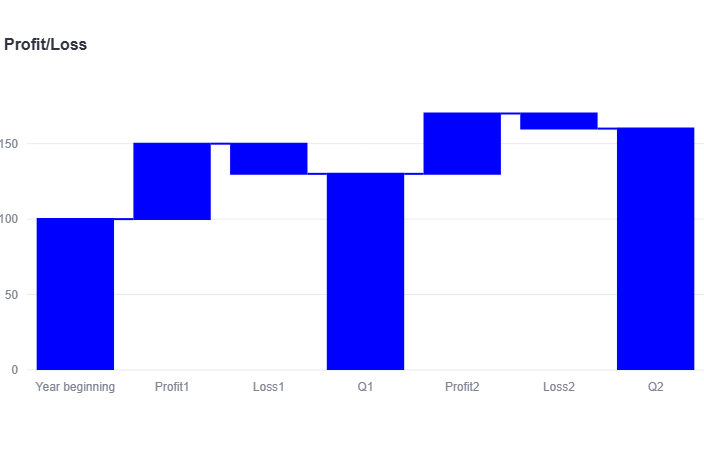
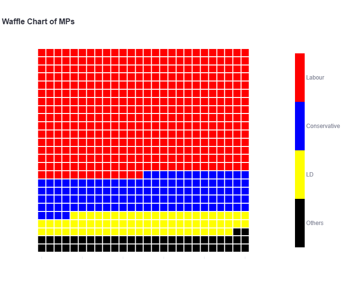
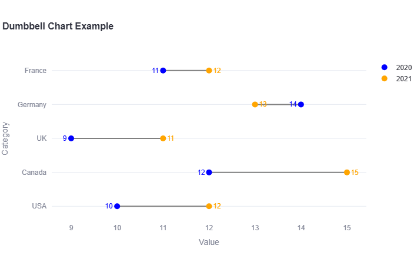
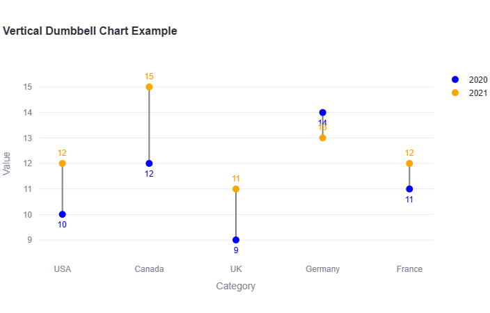

# Plotly Helper Library

[](https://opensource.org/licenses/MIT)

An advanced plotting library for Plotly that provides a collection of helper functions to create beautiful and informative visualizations with ease. This library simplifies the process of generating complex charts like waterfall, waffle, and dumbbell charts, allowing you to focus on your data and insights.

## Overview

This library provides functions for creating the following advanced chart types:

*   **Waterfall Chart:** Ideal for visualizing the cumulative effect of sequential positive and negative values.
*   **Waffle Chart:** Perfect for displaying progress toward a goal or the composition of a whole.
*   **Dumbbell Chart:** A great way to compare two data points and visualize the change between them.

## Installation

To install the Plotly Helper Library, you can use pip:

```bash
TBA
```

## Usage

Here are some examples of how to use the library to create different types of charts - the examples are configured as Streamlit apps.

To run the apps you need to do the following imports:

```python
import streamlit as st
import pandas as pd
import plotly_extras_0_2 as ph
```

### Waterfall Chart



```python
# --- Waterfall Chart ---
st.header("Waterfall Chart")
waterfall_df = pd.DataFrame({
    'Category': ["Year beginning", "Profit1", "Loss1", "Q1", "Profit2", "Loss2", "Q2"],
    'Value': [100, 50, -20, 130, 40, -10, 160] # Corrected data for totals
})
measure = ['relative','relative', 'relative','total', 'relative','relative','total']
fig_waterfall = ph.waterfall(df=waterfall_df, 
                             category_col='Category', 
                             value_col='Value', 
                             title="Profit/Loss",
                             measure=measure,
                             color='blue')
st.plotly_chart(fig_waterfall)
```

### Waffle Chart



```python
# --- Waffle Chart ---
st.header("Waffle Chart")
waffle_data = {'Others': 54, 'LD': 72, 'Conservative': 121, 'Labour': 403}
waffle_df = pd.DataFrame(list(waffle_data.items()), columns=['Party', 'Seats'])

fig_waffle = ph.waffle(df=waffle_df, 
                       category_col='Party', 
                       value_col='Seats',
                       title='Waffle Chart of MPs',
                       local_colors=['black', 'yellow', 'blue', 'red'])
st.plotly_chart(fig_waffle)
```

### Dumbbell Chart



```python
# --- Dumbbell Chart ---
st.header("Dumbbell Chart")
dumbbell_df = pd.DataFrame({
    'Country': ['USA', 'Canada', 'UK', 'Germany', 'France'],
    '2020': [10, 12, 9, 14, 11],
    '2021': [12, 15, 11, 13, 12]
})

fig_dumbbell = ph.dumbbell(df=dumbbell_df, 
                           category_col='Country', 
                           value1_col='2020', 
                           value2_col='2021',
                           label1='2020',
                           label2='2021',
                           title='Dumbbell Chart Example')
st.plotly_chart(fig_dumbbell)
```

### Vertical Dumbbell Chart



```python
# --- Vertical Dumbbell Chart ---
st.header("Vertical Dumbbell Chart")
fig_dumbbell_v = ph.dumbbell(df=dumbbell_df, 
                             category_col='Country', 
                             value1_col='2020', 
                             value2_col='2021',
                             label1='2020',
                             label2='2021',
                             title='Vertical Dumbbell Chart Example',
                             orientation='v')
st.plotly_chart(fig_dumbbell_v)
```

## API Reference

### `waterfall()`

Creates a waterfall chart.

**Parameters:**

*   `df` (pd.DataFrame): DataFrame containing the data.
*   `category_col` (str): Name of the column for categories.
*   `value_col` (str): Name of the column for values.
*   `title` (str, optional): Title of the chart.
*   `measure` (List[str], optional): List specifying whether each data point is 'relative' or 'total'.
*   `color` (str, optional): A common color for all elements.

### `waffle()`

Creates a waffle chart.

**Parameters:**

*   `df` (pd.DataFrame): DataFrame containing the data.
*   `category_col` (str): Name of the column for categories.
*   `value_col` (str): Name of the column for values.
*   `title` (str, optional): Title of the chart.
*   `local_colors` (List[str], optional): A list of colors for the categories.

### `dumbbell()`

Creates a dumbbell chart.

**Parameters:**

*   `df` (pd.DataFrame): DataFrame containing the data.
*   `category_col` (str): Name of the column for categories.
*   `value1_col` (str): Name of the column for the first value set.
*   `value2_col` (str): Name of the column for the second value set.
*   `label1` (str, optional): Label for the first value set.
*   `label2` (str, optional): Label for the second value set.
*   `title` (str, optional): Title of the chart.
*   `orientation` (str, optional): 'h' for horizontal (default), 'v' for vertical.

## License

This project is licensed under the MIT License.